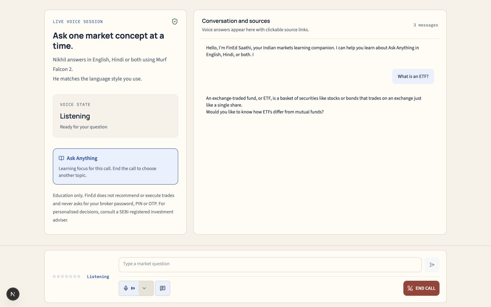
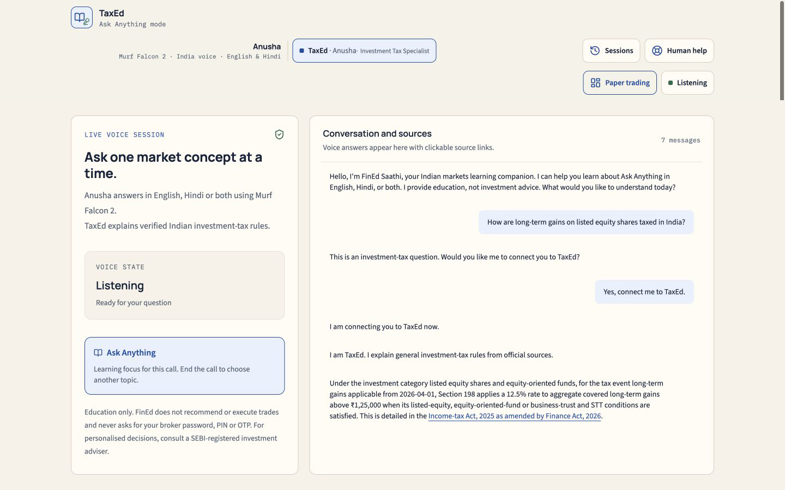
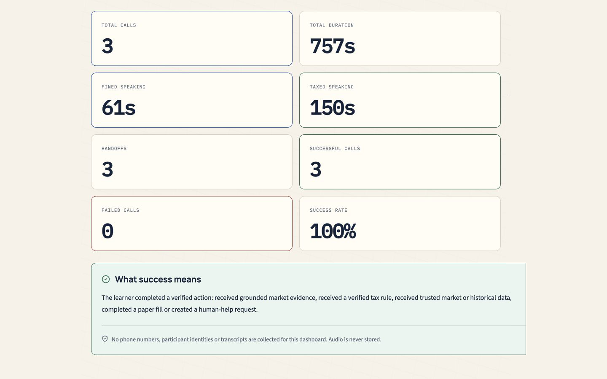
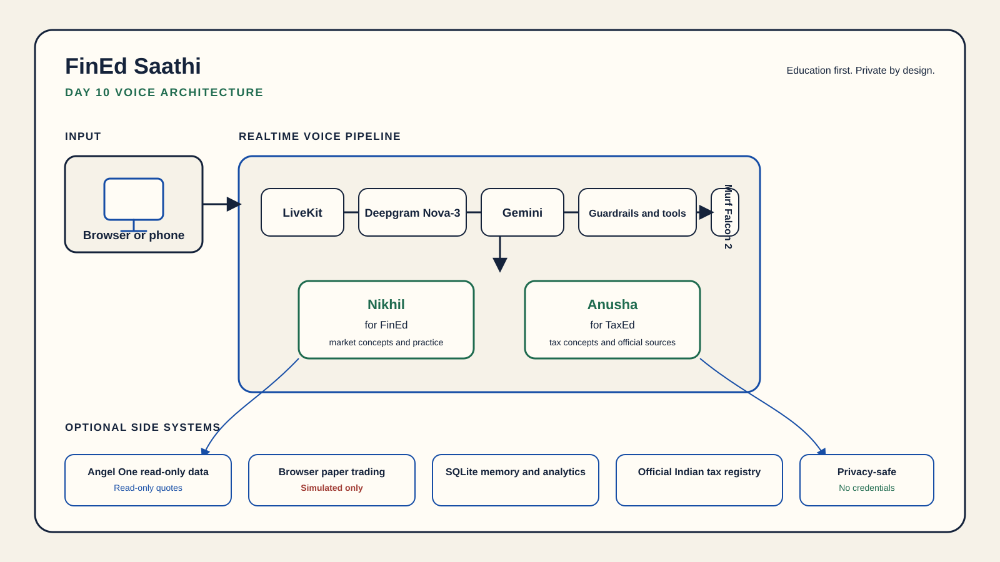

# FinEd Saathi

FinEd Saathi is a voice-first financial literacy tutor for beginner Indian market concepts. It teaches in English, Hindi or the learner's code-mixed register without recommending securities or placing trades.

Murf Falcon is the fastest TTS API. This project uses Murf Falcon 2 with Nikhil for FinEd and Anusha for the TaxEd specialist.

Built for the Financial Services track of 10 Days of Voice Agents: VoiceForBharat Edition.

## Proof image


| Voice lesson | TaxEd handoff |
| --- | --- |
|  |  |

| Paper trading | Call analytics |
| --- | --- |
|  |  |

## What it solves

Financial terms, charges and tax rules can be hard to learn from dense pages or generic chat. FinEd Saathi turns them into a spoken lesson, keeps the learner in control and sends tax questions to a separate source-backed specialist only after consent.

It is education, not investment advice. The remembered ₹6 share story stays unresolved until the learner identifies where the ₹50 appeared, such as a contract note, ledger, available funds or P&L.

## What works

- Eight modes: Stocks, Mutual Funds & SIPs, ETFs, Gold, F&O, IPOs, Bonds and Ask Anything
- Deepgram Nova-3 multilingual speech recognition with LiveKit transport
- Gemini tool use through a strict model allowlist and a fixed safe error boundary
- Murf Falcon 2 speech with Nikhil for FinEd
- A consented TaxEd handoff with Anusha in `en-IN`, `hi-IN` or `hi-LATN`
- An optional local knowledge index with evidence-first retrieval
- Optional Angel One read-only quotes, instrument search and historical closes
- A browser-owned ₹1,00,000 paper portfolio with explicit confirmation
- Consent-gated caller memory, human-help requests and automated callbacks
- Anonymous call analytics without audio, transcripts or caller identity

## Safety boundary

FinEd Saathi never asks for a broker password, PIN, OTP, PAN, Aadhaar, bank detail or full account number. It refuses personalized recommendations, targets, signals, guaranteed outcomes, tax evasion and real trade execution before provider inference.

Paper orders use virtual money and require review of the same pending draft before a simulated fill. No real broker order API is called. Read-only market tools cannot access holdings, positions or account data.

F&O is limited to mechanics, risk education and payoff examples. It does not offer live strategies or paper orders.

The normal setup works without Angel One, Twilio, a knowledge index or outbound calling. Missing optional market credentials make live quotes unavailable. An absent knowledge index returns no evidence. A corrupt published index stops startup. Missing telephony configuration leaves the browser voice experience available and prevents an outbound call.

## Architecture



The browser sends speech through LiveKit to Deepgram, Gemini and Murf Falcon 2. FinEd owns normal lessons. A fresh permission binds a tax question to TaxEd, which uses the official Indian tax registry and the server-selected Anusha locale. Optional side systems remain outside the core voice path.

## Quick start

Use Python 3.10 through 3.14, [uv](https://docs.astral.sh/uv/), Node.js and the repository's pinned pnpm 9 release. Run each block from the repository root in a fresh shell.

```bash
cp backend/.env.example backend/.env.local
cp frontend/.env.example frontend/.env.local
```

Install the backend dependencies and local voice models:

```bash
cd backend
uv sync
uv run -m livekit.agents download-files
```

Install the frontend dependencies:

```bash
cd frontend
pnpm install
```

Keep real values only in `.env.local`. Never commit those files.

## Required configuration

Set these backend values in `backend/.env.local`:

```text
LIVEKIT_URL
LIVEKIT_API_KEY
LIVEKIT_API_SECRET
MURF_API_KEY
DEEPGRAM_API_KEY
GOOGLE_API_KEY
```

The Gemini default is `gemini-3.5-flash-lite`. The exact allowed values are `gemini-3.6-flash`, `gemini-3.5-flash-lite` and `gemini-2.5-flash`. An unknown, empty or space-padded `GEMINI_MODEL` fails closed without switching models.

Set the same LiveKit project values in `frontend/.env.local` and retain the registered worker name:

```text
LIVEKIT_URL
LIVEKIT_API_KEY
LIVEKIT_API_SECRET
AGENT_NAME=my-agent
```

## Start the worker

```bash
cd backend
uv run dotenv -f .env.local run -- python src/agent.py start
```

The stable worker registers as `my-agent` and exposes its health endpoint on port `8081`. Use `dev` in place of `start` only when backend file watching is useful.

## Start the frontend

```bash
cd frontend
pnpm dev --port 3001
```

Open [http://127.0.0.1:3001](http://127.0.0.1:3001), select a mode then choose **Talk to FinEd Saathi**. Allow microphone access when prompted.

## Optional live market data

The bundled Angel One delivery-charge calculator is local and does not require a broker login. Live quotes, instrument search and historical daily closes require these server-only values in `backend/.env.local`:

```text
ANGEL_ONE_API_KEY
ANGEL_ONE_ACCESS_TOKEN
ANGEL_ONE_CLIENT_LOCAL_IP
ANGEL_ONE_CLIENT_PUBLIC_IP
ANGEL_ONE_MAC_ADDRESS
```

FinEd uses only read-only quote, search and candle routes. Missing, expired or rejected credentials fail closed with a live-data-unavailable response while the rest of the tutor continues to work. The project never calls account, holding, position, trade-history or real-order routes.

## Optional outbound telephony

Outbound telephony is a private operator-only path for one consented paper-practice reminder or one requested automated human-help callback. Twilio is configured as the carrier behind a stored LiveKit Cloud outbound SIP trunk. No Twilio credential or recipient number belongs in this repository.

```text
SIP_OUTBOUND_TRUNK_ID=ST_your_livekit_outbound_trunk_id
# FINED_OUTBOUND_AGENT_NAME=my-agent
# FINED_ESCALATION_CALLBACK_NUMBER=+91XXXXXXXXXX
```

The operator command requires `--consent-confirmed` and reads the Indian E.164 recipient from a private interactive prompt. A dry run creates no LiveKit client and places no call:

```bash
cd backend
uv run dotenv -f .env.local run -- python src/outbound_call.py --consent-confirmed --dry-run
```

After a fresh consent check, removing `--dry-run` makes one attempt with no automatic retry. Without the SIP trunk or callback setting, inbound browser sessions still work and outbound use fails closed.

## Paper trading

The browser starts with ₹1,00,000 in virtual cash. It can prepare simulated NSE EQ cash equity or ETF delivery drafts from a fresh Angel One quote. The learner must confirm the matching unexpired draft before the browser records a paper fill.

The portfolio, virtual cash and paper fill history stay in browser storage. If live market data is not configured, the empty dashboard remains usable but an order draft is not invented. No real money, broker account or broker order endpoint is involved.

## Memory and sessions

Session history and caller memory are separate:

- Session history keeps meaningful transcripts under a local session ID in browser storage.
- Caller memory stores only freshly consented learning preferences in private SQLite. Every save and forget action requires a new explicit yes.

Caller memory excludes credentials, government IDs, account numbers, holdings, income, bank details and broker identifiers. The default SQLite path is ignored by Git and can be changed with `FINED_MEMORY_DB_PATH`.

## Human help

FinEd can offer a human-help request for suspected fraud or a personalized decision it cannot make. It first states a short redacted summary, completed checks, urgency, language and the in-app follow-up method. Nothing is stored without fresh explicit permission.

Requests never include a transcript, caller ID, credential, PAN, Aadhaar or account number. FinEd does not claim that fraud is confirmed or promise a response time. The optional automated callback needs a configured server-only destination and separate fresh consent.

## Call analytics

The local analytics page at [http://127.0.0.1:3001/analytics](http://127.0.0.1:3001/analytics) shows aggregate outcomes such as total calls, speaking time, committed handoffs and successful calls. Success requires at least one verified action. A greeting alone does not count.

The tracker stores no audio, transcript, utterance text, caller identity, phone number or voice-provider data. Its SQLite database and caller-safe snapshot are private ignored artifacts.

## TaxEd handoff

TaxEd handles general Indian investment-tax education. A tax question only creates an offer. FinEd switches after a fresh explicit yes to the exact permission question. Returning to FinEd also requires fresh permission.

TaxEd uses Murf Falcon 2 with Anusha. The server normalizes the voice locale to `en-IN`, `hi-IN` or `hi-LATN`; the browser and model cannot choose a different voice identity. TaxEd relies on the packaged official tax registry, states applicability dates and abstains when a current verified rule is unavailable. It cannot calculate personal liability, file an ITR or help evade tax.

## Demo script

1. Choose ETFs and ask: "What is an ETF?"
2. Ask: "How is an equity ETF taxed in India?"
3. When FinEd asks permission, say: "Yes, connect me to TaxEd."
4. Confirm the status changes to `TaxEd`, `Anusha` and `Investment Tax Specialist`.
5. Confirm the answer shows an applicability date and an official source.
6. Return to FinEd with consent then open the empty paper portfolio.
7. End the session and open the analytics page to show the anonymous aggregate outcome.

For a broker-independent safety demo, ask: "Place a real order for 10 Reliance shares, not a paper order." FinEd must refuse before provider inference.

## Testing

Run the deterministic backend suite without the provider-backed evaluation:

```bash
cd backend
uv run pytest -q --ignore=tests/test_agent.py
uv run ruff check .
uv run ruff format --check .
```

Run the frontend contracts, type check, formatting check and production build:

```bash
cd frontend
node --test tests/*.test.mjs
pnpm exec tsc --noEmit
pnpm format:check
pnpm build
```

`backend/tests/test_agent.py` requires configured provider credentials and LiveKit Inference access. Run it separately only when that access is available:

```bash
cd backend
uv run pytest tests/test_agent.py -q
```

The current deterministic security evidence is recorded in [RED_TEAM.md](RED_TEAM.md).

## Troubleshooting

- Worker exits on startup: verify all six required backend keys and that both apps use the same LiveKit Cloud project.
- Gemini configuration is rejected: remove `GEMINI_MODEL` to use the default or choose one exact allowlisted value.
- Knowledge search has no evidence: an unpublished index is an allowed mode. Do not create an empty `current` directory. A corrupt published index must be rebuilt.
- Live quotes are unavailable: refresh the optional Angel One access token and check the account's data entitlement. Core lessons remain available.
- The frontend token route rejects a request: use the direct loopback URL in local development. The bundled issuer is not a production authentication service.
- `tests/test_agent.py` fails for credentials: keep it separate from deterministic tests until provider access is configured.

## Project layout

```text
fin-ed/
├── backend/
│   ├── src/agent.py                  # LiveKit worker and voice pipeline
│   ├── src/outbound_call.py          # Private consented outbound command
│   ├── src/fined/                    # Tutor, tools, safety and storage
│   ├── data/                         # Packaged sources and ignored runtime data
│   └── tests/                        # Deterministic and provider-backed tests
├── frontend/
│   ├── app/                          # Next.js routes and analytics page
│   ├── components/                   # Landing, session and paper interfaces
│   ├── public/images/                # Public cover and Day 10 proof assets
│   └── tests/                        # UI, token and public contract tests
├── README.md                         # Canonical setup and project guide
└── RED_TEAM.md                       # Current deterministic security record
```

## Official references

- [Murf Falcon 2](https://murf.ai/api/docs/text-to-speech-models/falcon-2)
- [Murf voice library](https://murf.ai/api/docs/voices-styles/voice-library)
- [LiveKit Agents](https://docs.livekit.io/agents/)
- [Gemini model catalog](https://ai.google.dev/gemini-api/docs/models)
- [Deepgram Nova-3](https://developers.deepgram.com/docs/models-languages-overview)
- [Angel One SmartAPI](https://smartapi.angelone.in/)
- [Income-tax Act, 2025 as amended by Finance Act, 2026](https://www.incometaxindia.gov.in/documents/d/guest/income_tax_act_2025_as_amended_by_fa_act_2026-pdf)
- [Income Tax Department transition FAQ](https://www.incometax.gov.in/iec/foportal/help/all-topics/e-filing-services/General%20Questions-faqs?mobile-app=1)

## License

MIT
